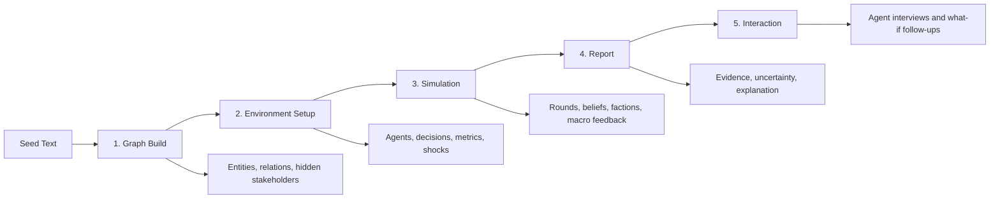

<div align="center">

# Murmura

**A universal prediction workbench for turning raw text into simulated worlds, agent reactions, and explainable possible futures.**

將任何文字變成可模擬的世界：人物、動機、集體反應、風險和可能未來。

[](LICENSE)
[](https://www.python.org/)
[](https://fastapi.tiangolo.com/)
[](https://vuejs.org/)
[](https://vite.dev/)

**Language / 語言:** [English](#english) · [中文](#中文)

[Quick Start](#quick-start) · [How It Works](#how-it-works) · [Features](#features) · [Maintainers](#maintainers) · [Contributing](#contributing) · [License](#license)

</div>

---

<a id="english"></a>

## What Is Murmura?

Murmura is a **general-purpose scenario simulation engine**. Give it a seed text, and it infers the actors, incentives, decisions, shocks, metrics, narratives, and feedback loops needed to explore what could happen next.

It is built for questions like:

- How might groups react to a policy, market shock, conflict, product launch, or public narrative?
- Which hidden stakeholders are not explicitly named in the source text?
- What assumptions drive the result?
- Which outcomes are stable, fragile, or highly sensitive to shocks?
- Why did the forecast move in that direction?

Murmura is not a crystal ball. It is a structured way to stress-test stories about complex systems.

## Demo Inputs

```text
A new competitor enters a B2B supply chain market with aggressive pricing.
```

```text
A central bank unexpectedly raises interest rates by 200 basis points.
```

```text
In a fictional kingdom, two factions compete for control after the monarch disappears.
```

## Quick Start

### Local

Requirements:

- Python 3.10 or 3.11
- Node.js 18+
- Git

```bash
git clone https://github.com/destinyfrancis/Murmura.git
cd Murmura
make quickstart
```

Then open:

```text
http://localhost:5173
```

Daily development:

```bash
make start      # backend :5001 + frontend :5173
make stop       # stop local services
make backend    # backend only
make frontend   # frontend only
```

### Docker

Run with your own `.env`:

```bash
cp .env.example .env
docker compose up -d
```

Run demo mode without API keys:

```bash
docker compose --profile demo up -d
```

Run with observability:

```bash
docker compose --profile observability up -d
```

## How It Works



| Step | What Happens |
|---|---|
| **1. Graph Build** | Seed text becomes a knowledge graph of entities, relationships, and implicit stakeholders. |
| **2. Environment Setup** | Murmura selects a simulation mode, creates agents, hydrates memory, and builds scenario config. |
| **3. Simulation** | Agents react across rounds, update beliefs, spread narratives, form factions, and respond to shocks. |
| **4. Report** | The system generates an explainable report with timelines, drivers, probabilities, and uncertainty. |
| **5. Interaction** | You can interview simulated agents and explore follow-up scenarios. |

## Features

| Capability | Description |
|---|---|
| **Universal seed input** | Works with news, policy, fiction, market events, company strategy, and custom scenarios. |
| **Automatic actor discovery** | Finds explicit entities and hidden stakeholders without manual setup. |
| **Knowledge graph reasoning** | Builds and visualizes relationships behind the scenario. |
| **Agentic simulation** | Runs heterogeneous agents with goals, memories, beliefs, and behavioral profiles. |
| **Belief and faction dynamics** | Tracks how positions spread, split, harden, or soften over time. |
| **Shock testing** | Injects policy, macro, narrative, supply-chain, and social shocks. |
| **What-if branches** | Compares alternative timelines and forked runs. |
| **Explainable reports** | Produces evidence-linked reports instead of opaque one-shot answers. |
| **Post-run interviews** | Lets you ask simulated actors why they acted, shifted, or resisted. |
| **Runtime model settings** | Change providers, keys, and per-step models from the Settings UI. |

## Simulation Presets

| Preset | Agents | Rounds | Best For |
|---|---:|---:|---|
| `FAST` | 100 | 15 | Demos and smoke tests |
| `STANDARD` | 300 | 20 | General scenario analysis |
| `DEEP` | 500 | 30 | Research-style runs |
| `LARGE` | 1,000 | 25 | Bigger stress tests |
| `MASSIVE` | 3,000 | 20 | Heavy simulations |
| `custom` | up to 50,000 | up to 100 | Advanced experiments |

The OASIS simulation engine requires Python 3.10 or 3.11. On Python 3.12+, Murmura degrades gracefully and disables the Simulation step instead of crashing.

## Architecture

```text
backend/
  app/api/          FastAPI routers
  app/domain/       domain packs, presets, and locale support
  app/models/       Pydantic models and frozen dataclasses
  app/services/     graph, simulation, reports, settings, analytics
  app/utils/        database, LLM, logging, telemetry, security helpers
  database/         SQLite schema
  tests/            unit and integration tests

frontend/
  src/views/        app screens
  src/components/   workbench UI components
  src/api/          API clients
  src/i18n/         Traditional Chinese and English copy
  src/utils/        rendering and safety helpers

data/
  benchmarks/       public benchmark fixtures
```

## Maintainers

Murmura is maintained by `destinyfrancis`.

Maintainer responsibilities include:

- reviewing issues and pull requests
- keeping the local quickstart, Docker setup, and CI workflows working
- triaging security reports and dependency risks
- maintaining public benchmark fixtures and regression tests
- preparing releases and documenting breaking changes

See [MAINTAINERS.md](MAINTAINERS.md) for the current maintainer list and project stewardship notes.

## Tech Stack

| Layer | Stack |
|---|---|
| Backend | FastAPI, Python 3.10/3.11, Pydantic V2, aiosqlite |
| Frontend | Vue 3, Vite, vue-i18n |
| Simulation | OASIS Agentic Engine via subprocess IPC |
| Database | SQLite WAL, schema migrations, runtime settings store |
| Analytics | DuckDB, LanceDB embeddings |
| LLM Providers | OpenRouter, Google, OpenAI-compatible providers, per-step overrides |

## Configuration

Start from the example file:

```bash
cp .env.example .env
```

Common settings:

| Variable | Purpose |
|---|---|
| `DEMO_MODE` | Run without live model keys when set to `true`. |
| `OPENROUTER_API_KEY` | Default key for agent generation and simulation decisions. |
| `GOOGLE_API_KEY` | Optional key for Google report models. |
| `AGENT_LLM_PROVIDER` | Default agent provider. |
| `AGENT_LLM_MODEL` | Main agent model. |
| `AGENT_LLM_MODEL_LITE` | Lower-cost model for background agents. |
| `LLM_PROVIDER` | Default report provider. |
| `AUTH_SECRET_KEY` | JWT signing key. Required when `DEBUG=false`. |
| `DATA_ENCRYPTION_KEY` | Encrypts API keys and connector/session secrets at rest. |
| `DATABASE_PATH` | SQLite database path. Defaults to `data/murmura.db`. |

Model selection can also be changed from the Settings page without restarting the server.

## API Surface

Murmura exposes a FastAPI backend on port `5001` during local development.

| Area | Examples |
|---|---|
| Graph | `POST /graph/build`, `GET /graph/{id}` |
| Simulation | `POST /simulation/quick-start`, `POST /simulation/start`, `GET /simulation/{id}/status` |
| Report | `POST /report/{id}/generate`, `GET /report/{id}/pdf` |
| Settings | `GET /api/settings`, `PUT /api/settings`, `POST /api/settings/test-key` |
| Interaction | agent interviews, public report views, follow-up analysis |

Run the backend locally and visit the generated FastAPI docs for exact request and response schemas.

## Testing

```bash
make test          # unit tests
make test-int      # integration tests
make test-all      # full test suite
make test-cov      # HTML coverage report
make test-changed  # tests related to changed files
```

Frontend:

```bash
cd frontend
npm run build
npm run dev
```

## Contributing

Contributions are welcome for bug fixes, documentation, tests, domain packs, provider integrations, and simulation reliability work.

Start with [CONTRIBUTING.md](CONTRIBUTING.md). For security issues, please do not open a public issue; follow [SECURITY.md](SECURITY.md).

## Public Repo Hygiene

This repository is intended to be public source code. Keep local state and secrets out of Git:

- Do not commit `.env`, `.env.local`, real API keys, tokens, private keys, or credentials.
- Do not commit generated reports, local logs, SQLite databases, vector stores, session data, coverage output, or build output.
- Keep durable architecture decisions in this README or concise public docs.
- Keep private plans, audits, scratch notes, and local workflow files out of the repository.

Relevant ignored paths include `.env`, `logs/`, `reports/`, `data/sessions/`, `data/reality_seeds/`, `data/vector_store/`, `frontend/dist/`, `htmlcov/`, and cache directories.

## Use Cases

| Domain | Example Question |
|---|---|
| Public policy | Which groups may support, oppose, or quietly resist this proposal? |
| Markets | How could a rate shock affect sentiment, liquidity, and narrative risk? |
| Companies | How may customers, suppliers, employees, and competitors react to a strategy shift? |
| Geopolitics | Which actors may escalate, de-escalate, hedge, or exploit uncertainty? |
| Public narrative | How could a message spread across platforms and communities? |
| Fiction | How would factions in a story world respond to a major shock? |
| Research | Which assumptions matter most, and where is the forecast fragile? |

## Limits

Murmura is for exploration, research, and scenario stress-testing. It is not a substitute for professional judgment.

Do not use Murmura as the only basis for:

- financial trading
- legal advice
- medical decisions
- safety-critical decisions
- regulatory or actuarial reporting

Good simulations need good input. Provide context, time horizon, actors, uncertainty, and the question you actually care about.

<a id="中文"></a>

## 中文

### Murmura 是什麼？

Murmura 是一個通用預測引擎。你輸入一段文字，它會自動推斷角色、持份者、信念、決策、衝擊、指標和可能結果，然後用多代理人模擬去探索「接下來可能會發生什麼」。

適合用於政策、公司策略、市場衝擊、公共敘事、地緣政治、研究和 fiction worldbuilding。它可以幫你做情景推演和壓力測試，但不應作為金融、法律、醫療或安全關鍵決策的唯一依據。

### 快速開始

本地運行需要：

- Python 3.10 或 3.11
- Node.js 18+
- Git

```bash
git clone https://github.com/destinyfrancis/Murmura.git
cd Murmura
make quickstart
```

然後打開：

```text
http://localhost:5173
```

日常開發：

```bash
make start      # backend :5001 + frontend :5173
make stop       # 停止本地服務
make backend    # 只啟動後端
make frontend   # 只啟動前端
```

Docker：

```bash
cp .env.example .env
docker compose up -d
```

無 API key demo mode：

```bash
docker compose --profile demo up -d
```

### 運作方式

| 步驟 | 內容 |
|---|---|
| **1. 建立圖譜** | 將 seed text 轉成實體、關係和隱含持份者。 |
| **2. 建立環境** | 選擇模擬模式，建立 agents，初始化記憶和 scenario config。 |
| **3. 運行模擬** | Agents 逐回合反應、更新信念、形成派系並回應衝擊。 |
| **4. 生成報告** | 輸出時間線、驅動因素、概率、不確定性和可解釋分析。 |
| **5. 互動追問** | 訪談模擬角色，或測試新的 what-if 情境。 |

### 主要功能

| 功能 | 說明 |
|---|---|
| **通用輸入** | 支援新聞、政策、fiction、市場事件、公司策略和自訂情境。 |
| **自動尋找角色** | 找出明示實體和未被直接提到的隱含持份者。 |
| **知識圖譜推理** | 建立並視覺化場景背後的關係。 |
| **多代理人模擬** | 使用具有目標、記憶、信念和行為特徵的 agents。 |
| **信念與派系動態** | 追蹤觀點如何擴散、分裂、強化或降溫。 |
| **衝擊測試** | 注入政策、宏觀、敘事、供應鏈和社會衝擊。 |
| **What-if 分支** | 比較不同時間線和 forked runs。 |
| **可解釋報告** | 產生有證據鏈和推理脈絡的報告。 |
| **模擬角色訪談** | 追問 agents 為什麼行動、改變或抗拒。 |
| **即時模型設定** | 在 Settings UI 內更換 provider、API key 和每一步模型。 |

### 設定

先複製公開範例檔：

```bash
cp .env.example .env
```

常用設定：

| 變數 | 用途 |
|---|---|
| `DEMO_MODE` | 設為 `true` 時可不用 live model key。 |
| `OPENROUTER_API_KEY` | 預設 agent generation 和 simulation decisions key。 |
| `GOOGLE_API_KEY` | Google report model 的可選 key。 |
| `AGENT_LLM_PROVIDER` | 預設 agent provider。 |
| `AGENT_LLM_MODEL` | 主要 agent model。 |
| `AGENT_LLM_MODEL_LITE` | 背景 agents 使用的低成本模型。 |
| `LLM_PROVIDER` | 預設 report provider。 |
| `AUTH_SECRET_KEY` | JWT 簽名 key；`DEBUG=false` 時必須設定。 |
| `DATA_ENCRYPTION_KEY` | 用於加密 API keys 和 connector/session secrets。 |
| `DATABASE_PATH` | SQLite database path，預設為 `data/murmura.db`。 |

### 測試

```bash
make test          # unit tests
make test-int      # integration tests
make test-all      # full test suite
make test-cov      # HTML coverage report
make test-changed  # 只跑與改動相關的測試
```

前端：

```bash
cd frontend
npm run build
npm run dev
```

### 公開 Repo 衛生守則

- 不要提交 `.env`、真實 API keys、tokens、private keys 或 credentials。
- 不要提交生成報告、本地 logs、SQLite DB、vector stores、session data、coverage output 或 build output。
- 長期架構決策應放在 README 或簡潔公開文件中。
- 私人 plan、audit、scratch notes 和本地 workflow 檔案不要放入 repo。

### 限制

Murmura 適合探索、研究和情景壓力測試，不是專業判斷的替代品。

不要把 Murmura 作為以下事項的唯一依據：

- 金融交易
- 法律意見
- 醫療決策
- 安全關鍵決策
- 監管或精算報告

## License

Murmura is licensed under the **GNU Affero General Public License v3.0 or later (AGPL-3.0-or-later)**.

Commercial use is allowed under the AGPL. If you modify Murmura and distribute it, or run a modified version as a network service, you must provide the corresponding source code under the same license terms.

AGPL 允許商業使用。若你修改 Murmura 並分發，或把修改版作為網絡服務提供，通常需要按同一授權條款公開相應源碼。

This license is OSI-approved and is intended to keep improvements to network-hosted versions available to the community.

Copyright (c) 2026 destinyfrancis. All rights reserved.
